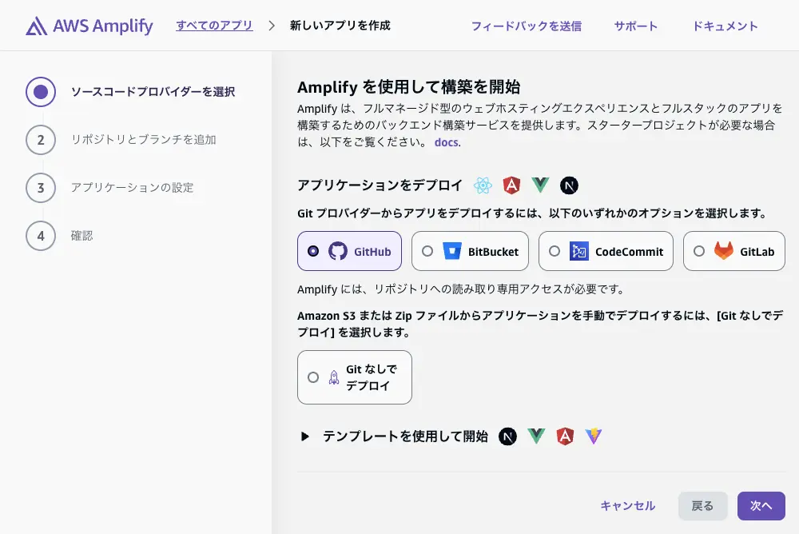
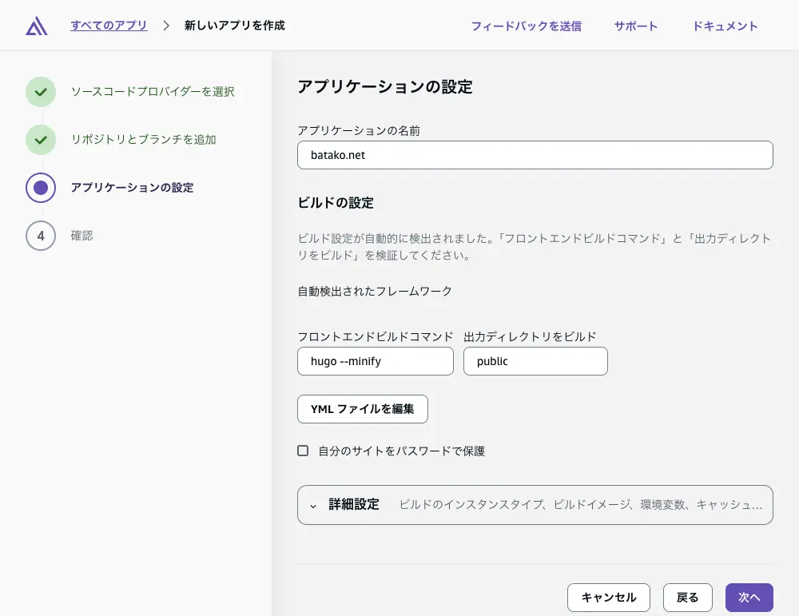
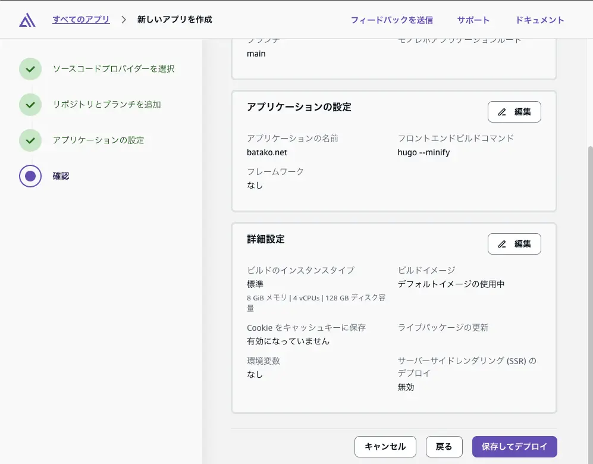
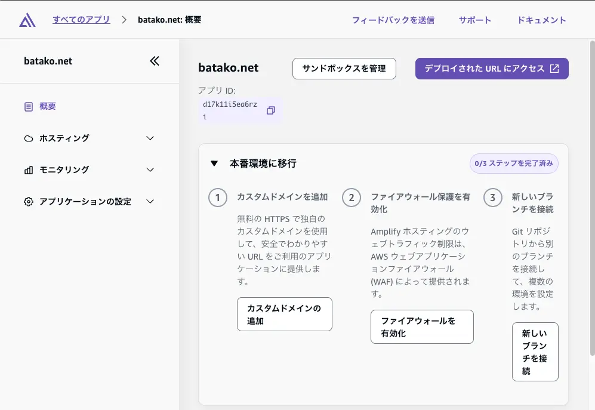
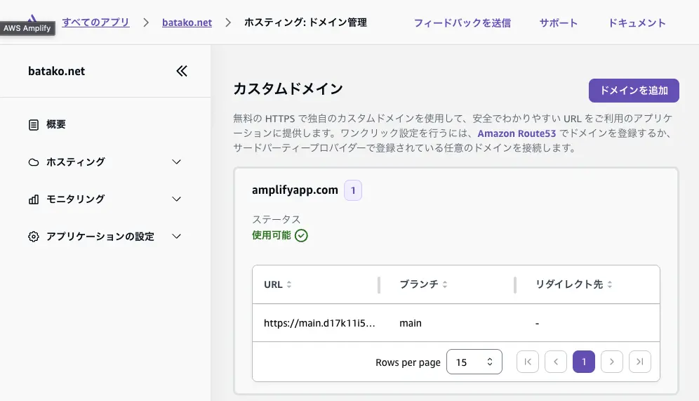
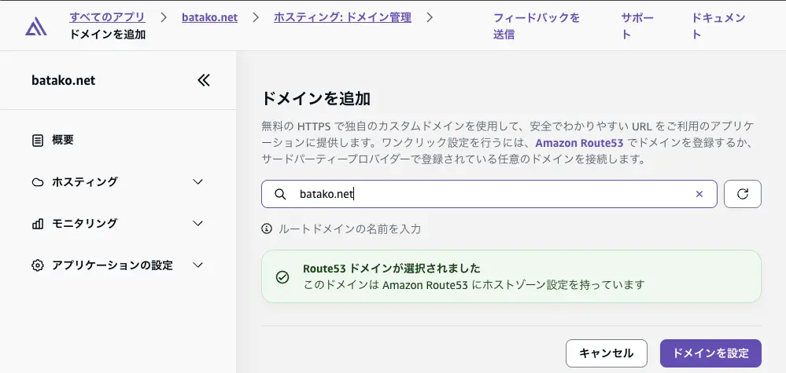
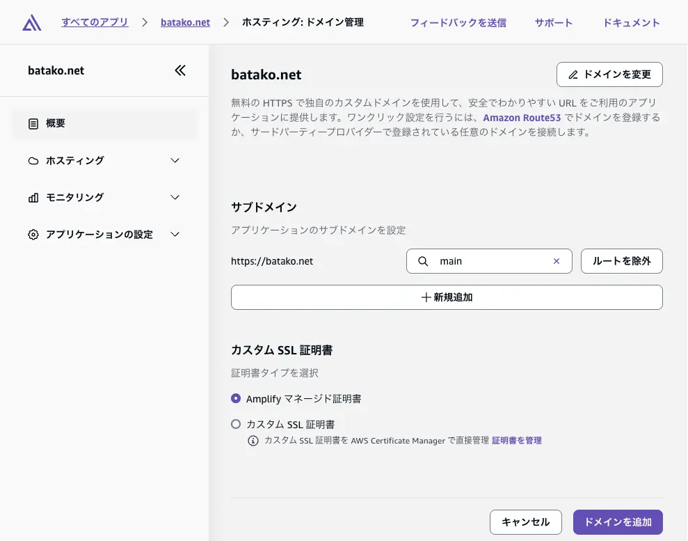

## 静的サイトを作成してGithubにプッシュする

下記は hugo を使って作成した。

https://github.com/batako/batako.net

## Amplify からアプリを作成

### AWSのAmplifyのページに遷移し「新しいアプリを作成」を押下

### GitプロバイダーからGithubを選択

Githubへのアクセス許可を与える必要があるので適宜選択。

### リポジトリとブランチを選択

選択したブランチにプッシュすると自動でデプロイされる。

### ビルドコマンドの設定と公開するディレクトリを指定

hugoを使用した例

### 設定内容の確認

## カスタムドメインの割り当て

### カスタムドメインページに遷移

作成したアプリの概要ページから「カスタムドメインの追加」ボタンを押下する。

### ドメイン追加ページに遷移

「ドメインを追加」ボタンを押下する。

### 割り当てたいドメインを入力

### サブドメインの設定

カスタムSSL証明書では「Amplifyマネージド証明書」を選択すると楽かも。

「ドメインを追加」ボタンを押下して反映されるまで待機する。

