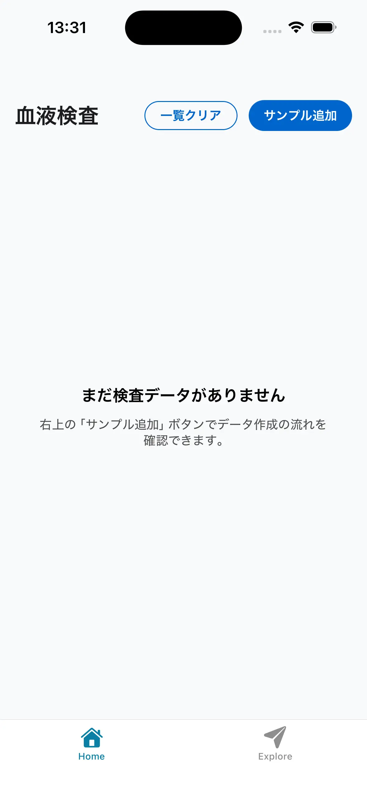
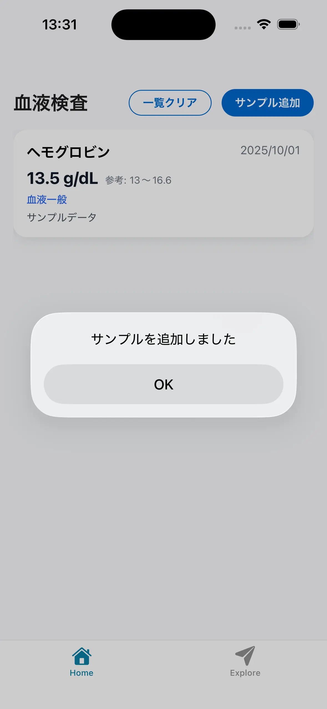
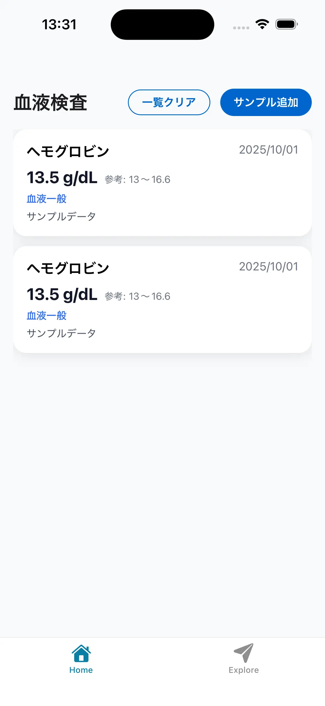
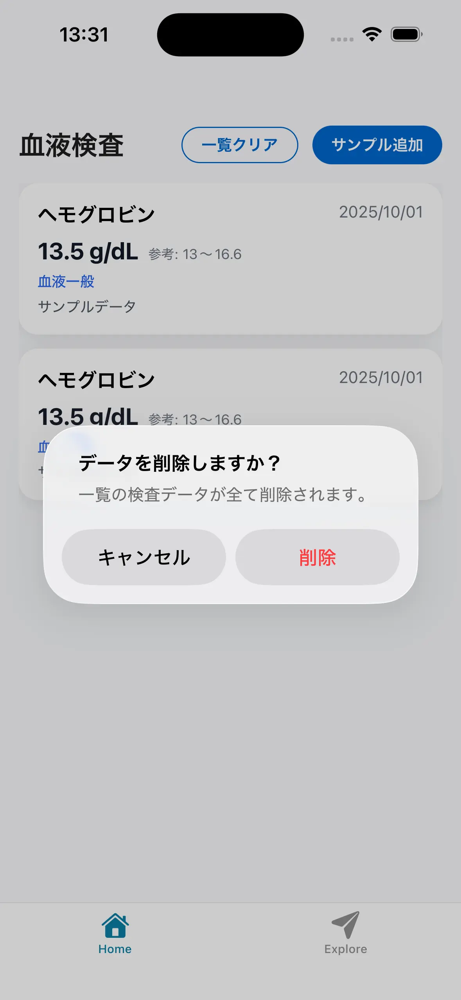
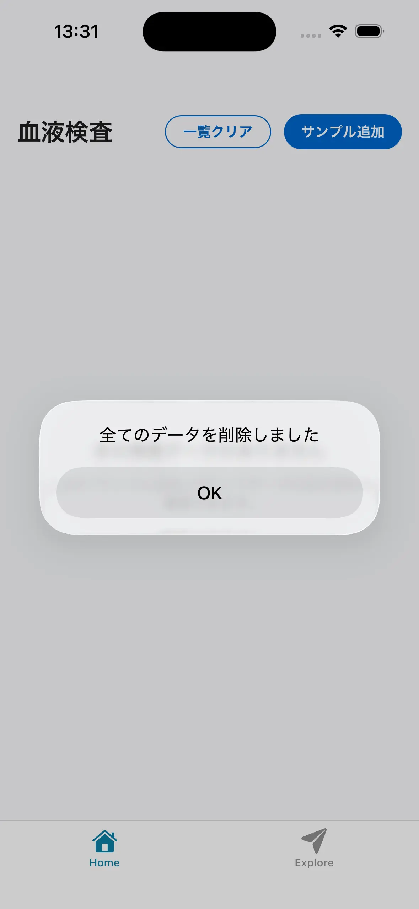

+++
title = "AmplifyのStorageなかなかよさげ"
date = "2025-10-02"
description = ""
categories = [
  "Web開発",
]
tags = [
  "BearyHealth",
  "amplify",
  "aws",
]
series = []
+++

モバイルアプリを作ろうとしてて、DBを何にするか色々見てたらAmplify Storageで実装すると楽できて良さそうだった。

Realmも候補にあがったけど、Webアプリにも展開することを考えると面倒なのでやめた。基本的にオフラインで運用して、気が向いたらオンラインも実装して、後々Webアプリも作るかみたいなノリだと、Realm使うと面倒なことになりそうなので。（ほぼ自分専用アプリなので運用費を抑えたい。。。）

基本的にはRealm使えば良いのかも？

サンプル作ってみた

## Amplify Storage と Realm の比較

| 項目 | Amplify Storage | Realm |
|------|----------------|-------|
| **主用途** | 画像・ファイル保存（S3） | 構造化データ保存（ローカルDB）、必要に応じて同期 |
| **データ形式** | バイナリ・ファイル（画像・PDF・音声など） | JSONライクなオブジェクト（数値・文字列・配列など） |
| **オフライン対応** | ✕ 基本オンライン必須（ローカルキャッシュはアプリ側実装次第） | ◎ ローカルDBで完全オフライン動作 |
| **同期機能** | AWS S3 に直接保存。同期というより「クラウドストレージ共有」 | Realm Sync により MongoDB Atlas と双方向同期 |
| **クエリ・検索** | ✕ なし（S3はファイル名やタグ管理程度） | ◎ 複雑なクエリ可能（フィルタ・ソート） |
| **バックアップ** | AWS S3 に自動保存されるため耐障害性あり | ローカルDBは端末依存。クラウド同期を有効化すればAtlasに保存 |
| **料金体系** | S3：容量 + リクエスト数課金 Amplifyで統合管理可能 | MongoDB Atlas：クラスタ課金（M2/M5で$9〜/月） |
| **拡張性** | AWSサービスと統合（認証・分析・CDN配信） | MongoDB Atlasのエコシステムと統合 |
| **向いているケース** | 画像・検査票PDFなど「ファイル」を保存・共有したい場合 | 血液検査の数値データなど「構造化データ」を保存したい場合 |

## リンク

- [Storage - AWS Amplify Gen 2 Documentation](https://docs.amplify.aws/react/build-a-backend/storage/?utm_source=chatgpt.com)
- [Realm Open Source](https://realm.github.io/#top)
